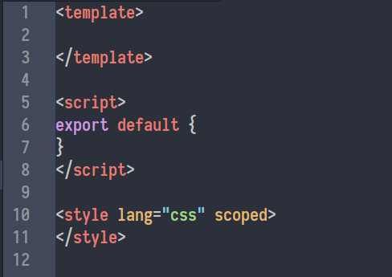
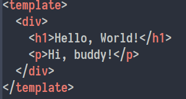
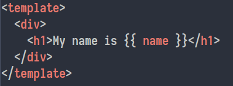
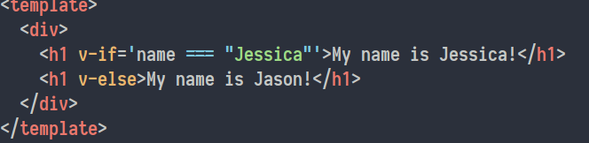
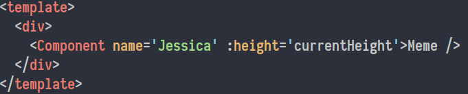
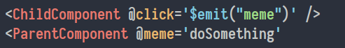
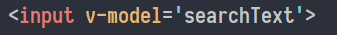
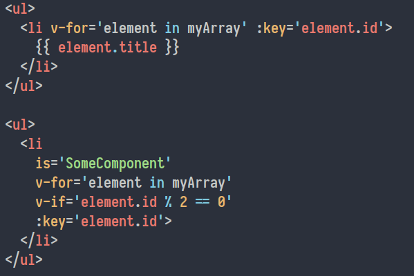
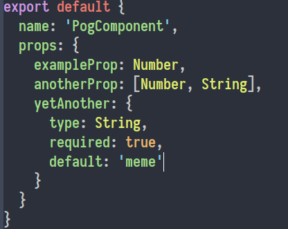

## Component Basics
A component is a reusable piece of code that describes a chunk of your application.  On several websites, each element of the page can be thought of as a component.  In addition to just the visible pieces of a user interface, a component can hold other components.  If all they do is hold other components, they can also be called containers.

#### Creating Components
Unlike several other frameworks, component files often have the HTML, JavaScript, and CSS for a given component all in the same file.  This is a stylistic choice that Atom defaults to if you want to quickly create components.  Component files end in `.vue`, so (ideally in a components folder) create a new `.vue` file and type `template` followed by a `tab`.  It should auto-generate a component skeleton.  It should look something like this:

#### Component Components
The `<template>` tags are the HTML of the component: the visuals.  This is what your component renders when it is loaded onto a page.  If you want to change the way a component's data is displayed, this is where to look first.

The `<script>` tags hold the behavior of the component.  This section uses JavaScript and can take advantage of ES6 features like the spread operator and arrow functions.  A component's state, methods, and lifecycle behavior are all defined here.  The exported object is the actual object that other files will interact with.

The `<style>` tags hold the styling of the component.  I use CSS to style my components, but that's only because I don't know SASS/SCSS, and I hear those require additional styling files.  I suppose it would be more practical for components with an assload of styling, like supporting themes or something, but for something simple, CSS does the job well enough for me.

#### The Template
There are a few simple things to know for the `<template>` section.
1. Everything must be in a single wrapping tag.  

Both the `h1` and `p` tags will render, but without the surrounding `div`, you'll get an error.  Everything must be encompassed by one tag.

2. You can use mustaches to include variable data.  

We'll get to where the data comes from in a little bit, but depending on the value of `name`, the template will render something different.  This is helpful!

3. Directives can be used for conditional rendering.  

The `v-if` and `v-else` attributes you see in the tags are called **directives** in Vue.  There are several other directives, but we'll cover them later.  As you can see, depending on the value of `name`, a different `h1` will be rendered.  Between the single quotes in the `v-if` directive are JavaScript expressions, and any valid JavaScript expression can be used here.

#### The JavaScript Part
This is where the logic of a component gets placed.  Vue components are objects with several other object fields.  A few of them are:
1. `components` - if the component uses other components, they must be registered here.
2. `props` - if the component is to receive props (more on this later), this is where you register those props and do optional type checking.  For simple use, it's an array of strings that label the expected props.
3. `data` - if your component needs to store local state, it is done through a `data` *function*.
4. `methods` - if your component has methods that go with it, they get written here.

I know this is a lot to take in, but altogether it'll look something like this:  
")

###### A note on props
Props (short for properties) are bits of information passed to a component that it may not know ahead of time.  In the template section, the `name` variable might be passed to the component as a prop.  If the `name` prop is passed as the string `Jessica`, then `Jessica` will be rendered.  We will expand on this later.

Not all of these sections are required for a component to work, for example a component may have no methods or data to store.  

#### The Style
This is where your styling goes.  If you know CSS, it's just a css file starting here.  No special rules or anything.  Easy!

## Components but more

#### Props again
Passing props is something you'll be doing a lot of when working with components.  Props can be passed like you would an attribute for an HTML tag, like so:  

Notice the difference between the `name` and `height` props.  The name prop just has `name` with no colon, so it is a static prop.  No matter the details of the Component, the `name` property will always have the value `Jessica`.  For the `height` property, the colon means that the value is dynamic based on the value of `currentHeight`.  This is actually shorthand for the directive `v-bind:height`, but the colon is much less verbose.

Remember, if a component receives props, those props must be registered in the component file.  Also note how components can be closed with a self-closing tag.

#### Passing data up
Props are a way for parent components to send information down the component tree to child components.  If you want to do the reverse, then you need to have the child components **emit** an event.  Parents will then be listening for that event with the `v-on` directive (which can be abbreviated with `@`).  
  
Here, when the child component is clicked, it will notify the parent component to execute `doSomething`.  This data pattern is unlike React, which has a unidirectional data flow.

#### Two-way data binding
Another way Vue differs from react is the ability to directly bind data in two-ways.  If something rendered in the template comes from something in the data store, but when changed from the HTML should also be changed in the data store, then use the `v-model` directive.  
  
This will load the value of `searchText` into the input field, but upon typing in the input field will also change the value of `searchText`.

#### List Rendering
A list can be easily rendered using the `v-for` directive.  
  
It's important to note that the `v-for` directive is placed on the `li` elements, not the `ul`.  When rendering a list of content that depends on variable data (such as the values in `myArray`), a `key` property is required.  The `key` needs to be a unique identifier for the item in the array, such as an `id` field.

The second example shows how you could use a list of data to render multiple components.  Note also how you can use `v-for` alongside `v-if` to check a conditional on each iteration of the `for` loop.  There are multiple ways to achieve component renders, but this is one way that I used.

#### Prop Validation
For simple cases, props can be passed with an array, but in practice, they should be type-checked and validated so that users can't send invalid props to components.  
  
Here, the expected props also have expected types.  If a prop is passed with an invalid type, you'll get an error.  You can also see how a prop could accept multiple types.  In the `yetAnother` prop, you can see how you can make some props required by setting its `required` attribute, or give it a default value if none was to be provided (looking back I guess you'd never need a default value if `required` is true...)
